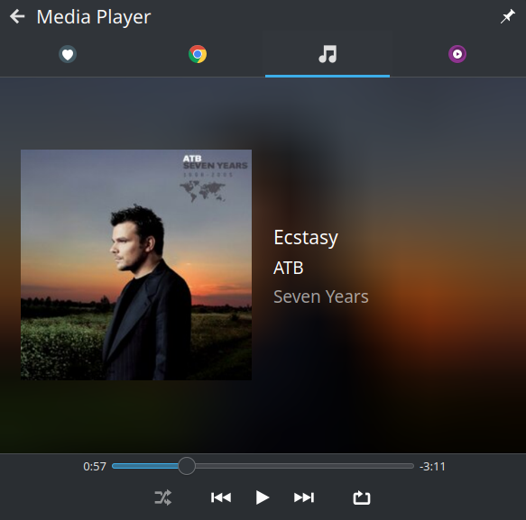

# audio_service_mpris

This platform interface allows you to use [audio_service](https://pub.dev/packages/audio_service) on Linux with Desktop Environment supporting Media Player Remote Interfacing Specification.



## Getting Started

Add the plugin to you flutter project.

```bash
flutter pub add audio_service_mpris
```

## What is supported

### org.mpris.MediaPlayer2

**Methods**

| Name                                                                                          | Supported |
|-----------------------------------------------------------------------------------------------|-----------|
| [Raise](https://specifications.freedesktop.org/mpris-spec/2.2/Media_Player.html#Method:Raise) | ❌         |
| [Quit](https://specifications.freedesktop.org/mpris-spec/2.2/Media_Player.html#Method:Quit)   | ❌         |

**Properties**

| Name                                                                                                                        | Supported | Value                                                                   |
|-----------------------------------------------------------------------------------------------------------------------------|-----------|-------------------------------------------------------------------------|
| [CanQuit](https://specifications.freedesktop.org/mpris-spec/2.2/Media_Player.html#Property:CanQuit)                         | ✅         | false                                                                   |
| [Fullscreen](https://specifications.freedesktop.org/mpris-spec/2.2/Media_Player.html#Property:Fullscreen)                   | ✅         | false                                                                   |
| [CanSetFullscreen](https://specifications.freedesktop.org/mpris-spec/2.2/Media_Player.html#Property:CanSetFullscreen)       | ✅         | false                                                                   |
| [CanRaise](https://specifications.freedesktop.org/mpris-spec/2.2/Media_Player.html#Property:CanRaise)                       | ✅         | false                                                                   |
| [HasTrackList](https://specifications.freedesktop.org/mpris-spec/2.2/Media_Player.html#Property:HasTrackList)               | ✅         | false                                                                   |
| [Identity](https://specifications.freedesktop.org/mpris-spec/2.2/Media_Player.html#Property:Identity)                       | ✅         | androidNotificationChannelName taken from audio_service platform config |
| [DesktopEntry](https://specifications.freedesktop.org/mpris-spec/2.2/Media_Player.html#Property:DesktopEntry)               | ✅         | Empty string                                                            |
| [SupportedUriSchemes](https://specifications.freedesktop.org/mpris-spec/2.2/Media_Player.html#Property:SupportedUriSchemes) | ✅         | `[]`                                                                    |
| [SupportedMimeTypes](https://specifications.freedesktop.org/mpris-spec/2.2/Media_Player.html#Property:SupportedMimeTypes)   | ✅         | `[]`                                                                    |

### org.mpris.MediaPlayer2.Player

**Methods**

| Name                                                                                                          | Supported |
|---------------------------------------------------------------------------------------------------------------|-----------|
| [Next](https://specifications.freedesktop.org/mpris-spec/2.2/Player_Interface.html#Method:Next)               | ✅         |
| [Previous](https://specifications.freedesktop.org/mpris-spec/2.2/Player_Interface.html#Method:Previous)       | ✅         |
| [Pause](https://specifications.freedesktop.org/mpris-spec/2.2/Player_Interface.html#Method:Pause)             | ✅         |
| [PlayPause](https://specifications.freedesktop.org/mpris-spec/2.2/Player_Interface.html#Method:PlayPause)     | ✅         |
| [Stop](https://specifications.freedesktop.org/mpris-spec/2.2/Player_Interface.html#Method:Stop)               | ✅         |
| [Play](https://specifications.freedesktop.org/mpris-spec/2.2/Player_Interface.html#Method:Play)               | ✅         |
| [Seek](https://specifications.freedesktop.org/mpris-spec/2.2/Player_Interface.html#Method:Seek)               | ❌         |
| [SetPosition](https://specifications.freedesktop.org/mpris-spec/2.2/Player_Interface.html#Method:SetPosition) | ✅         |
| [OpenUri](https://specifications.freedesktop.org/mpris-spec/2.2/Player_Interface.html#Method:OpenUri)         | ❌         |

**Signals**

| Name                                                                                                | Supported |
|-----------------------------------------------------------------------------------------------------|-----------|
| [Seeked](https://specifications.freedesktop.org/mpris-spec/2.2/Player_Interface.html#Signal:Seeked) | ❌         |

**Properties**

| Name                                                                                                                  | Supported | Value                                             |
|-----------------------------------------------------------------------------------------------------------------------|-----------|---------------------------------------------------|
| [PlaybackStatus](https://specifications.freedesktop.org/mpris-spec/2.2/Player_Interface.html#Property:PlaybackStatus) | ✅         | Being changed on AudioHandler player state change |
| [LoopStatus](https://specifications.freedesktop.org/mpris-spec/2.2/Player_Interface.html#Property:LoopStatus)         | ✅         | `'None'`                                          |
| [Rate](https://specifications.freedesktop.org/mpris-spec/2.2/Player_Interface.html#Property:Rate)                     | ✅         | `1.0`                                             |
| [Shuffle](https://specifications.freedesktop.org/mpris-spec/2.2/Player_Interface.html#Property:Shuffle)               | ❌         |                                                   |
| [Metadata](https://specifications.freedesktop.org/mpris-spec/2.2/Player_Interface.html#Property:Metadata)             | ✅         | Being changed on AudioHandler mediaItem change    |
| [Volume](https://specifications.freedesktop.org/mpris-spec/2.2/Player_Interface.html#Property:Volume)                 | ❌         | AudioServicePlatform doesn't support it           |
| [Position](https://specifications.freedesktop.org/mpris-spec/2.2/Player_Interface.html#Property:Position)             | ✅         | Being changed on AudioHandler player state change |
| [MinimumRate](https://specifications.freedesktop.org/mpris-spec/2.2/Player_Interface.html#Property:MinimumRate)       | ✅         | `1.0`                                             |
| [MaximumRate](https://specifications.freedesktop.org/mpris-spec/2.2/Player_Interface.html#Property:MaximumRate)       | ✅         | `1.0`                                             |
| [CanGoNext](https://specifications.freedesktop.org/mpris-spec/2.2/Player_Interface.html#Property:CanGoNext)           | ✅         | `true`                                            |
| [CanGoPrevious](https://specifications.freedesktop.org/mpris-spec/2.2/Player_Interface.html#Property:CanGoPrevious)   | ✅         | `true`                                            |
| [CanPlay](https://specifications.freedesktop.org/mpris-spec/2.2/Player_Interface.html#Property:CanPlay)               | ✅         | `true`                                            |
| [CanPause](https://specifications.freedesktop.org/mpris-spec/2.2/Player_Interface.html#Property:CanPause)             | ✅         | `true`                                            |
| [CanSeek](https://specifications.freedesktop.org/mpris-spec/2.2/Player_Interface.html#Property:CanSeek)               | ✅         | `true`                                            |
| [CanControl](https://specifications.freedesktop.org/mpris-spec/2.2/Player_Interface.html#Property:CanControl)         | ✅         | `true`                                            |

### org.mpris.MediaPlayer2.TrackList

Not supported

### org.mpris.MediaPlayer2.Playlists

Not supported

