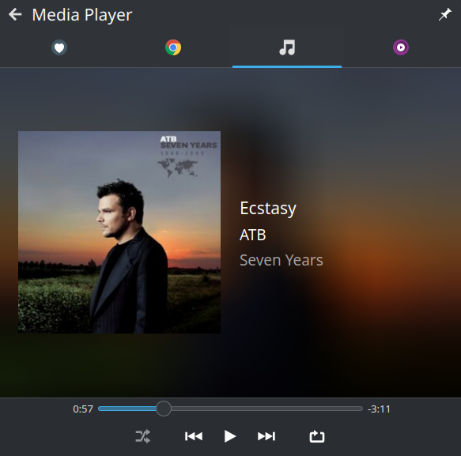

# audio_service_mpris

Linux MPRIS integration for [`audio_service`](https://pub.dev/packages/audio_service).

This plugin enables Media Player Remote Interfacing Specification (MPRIS) support on Linux desktop environments such as KDE Plasma and GNOME.



##  1.0.0 Beta

Version `1.0.0-beta.1` is now available for testing. This version adds support for specifying default values for properties not managed by [audio_service](https://pub.dev/packages/audio_service), and allows updating all properties at runtime.

###  Install beta version

```yaml
dependencies:
  audio_service_mpris: ^1.0.0-beta.1
```

###  Stability

This is a beta release and may contain issues. It is **not recommended for production use**.

###  Feedback

Please test this version and report any issues: https://github.com/bdrazhzhov/audio-service-mpris/issues

If no major issues are found, this will be released as `1.0.0`.

------

## Installation

Add the plugin to your Flutter project:

```bash
flutter pub add audio_service_mpris
```

## Usage

Initialize MPRIS in `main()`:

```dart
AudioServiceMpris.init(
  dBusName: 'MyMusicPlayer',
  identity: 'My Music Player',
  desktopEntry: 'com.example.music',
  minimumRate: 0.5,
  maximumRate: 2.0,
  canGoNext: true,
  canGoPrevious: true,
  canPlay: true,
  canPause: true,
  canControl: true,
  onRaiseRequest: () => ... ,
  onQuitRequest: () => ... ,
);
```

All parameters are optional.

If `onRaiseRequest` and `onQuitRequest` are set, the provided functions will be called each time the `Raise` and `Quit` methods are invoked via DBus, respectively. Additionally, the `CanRaise` and `CanQuit` properties are set to `true` if `onRaiseRequest` and `onQuitRequest` are defined, respectively.

### Updating properties at runtime

You can save value returned by `AudioServiceMpris.init(...)` and use it when you need to change properties. Or create `Mpris()` object:

```dart
final mpris = AudioServiceMpris.init(...);
// or
final mpris = Mpris();
mpris.identity = 'My Music Player';
mpris.desktopEntry = 'com.example.music';
mpris.minimumRate = 0.5;
mpris.maximumRate = 2.0;
mpris.canGoNext = true;
mpris.canGoPrevious = true;
mpris.canPlay = true;
mpris.canPause = true;
mpris.canControl = true;
```

Note: Properties `canPlay`, `canPause`, `canGoNext`, and `canGoPrevious` are only effective when `canControl` is set to `true`.

## Supported interfaces

### org.mpris.MediaPlayer2

#### Methods

| Method                                                                                        | Supported |
|-----------------------------------------------------------------------------------------------|-----------|
| [Raise](https://specifications.freedesktop.org/mpris-spec/2.2/Media_Player.html#Method:Raise) | ✅         |
| [Quit](https://specifications.freedesktop.org/mpris-spec/2.2/Media_Player.html#Method:Quit)   | ✅         |

#### Properties

| Property            | Supported | Default             |
|---------------------|-----------|---------------------|
| CanQuit             | ✅         | false               |
| Fullscreen          | ✅         | false               |
| CanSetFullscreen    | ✅         | false               |
| CanRaise            | ✅         | false               |
| HasTrackList        | ✅         | false               |
| Identity            | ✅         | `'My Audio Player'` |
| DesktopEntry        | ✅         | `''`                |
| SupportedUriSchemes | ✅         | `[]`                |
| SupportedMimeTypes  | ✅         | `[]`                |

------

### org.mpris.MediaPlayer2.Player

#### Methods

| Method      | Supported                                 |
|-------------|-------------------------------------------|
| Next        | ✅                                         |
| Previous    | ✅                                         |
| Pause       | ✅                                         |
| PlayPause   | ✅                                         |
| Stop        | ✅                                         |
| Play        | ✅                                         |
| Seek        | ❌ No equivalent in `AudioServicePlatform` |
| SetPosition | ✅                                         |
| OpenUri     | ✅                                         |

#### Signals

| Signal | Supported                                 |
|--------|-------------------------------------------|
| Seeked | ❌ No equivalent in `AudioServicePlatform` |

#### Properties

| Property       | Supported | Default                         |
|----------------|-----------|---------------------------------|
| PlaybackStatus | ✅         | Updated from AudioHandler state |
| LoopStatus     | ✅         | `'None'`                        |
| Rate           | ✅         | `1.0`                           |
| Shuffle        | ✅         | `false`                         |
| Metadata       | ✅         | Updated from current media item |
| Volume         | ❌         | Not supported                   |
| Position       | ✅         | Updated from AudioHandler state |
| MinimumRate    | ✅         | `1.0`                           |
| MaximumRate    | ✅         | `1.0`                           |
| CanGoNext      | ✅         | `false`                         |
| CanGoPrevious  | ✅         | `false`                         |
| CanPlay        | ✅         | `false`                         |
| CanPause       | ✅         | `false`                         |
| CanSeek        | ❌         | `false`                         |
| CanControl     | ✅         | `false`                         |

------

### org.mpris.MediaPlayer2.TrackList

Not supported.

### org.mpris.MediaPlayer2.Playlists

Not supported.

